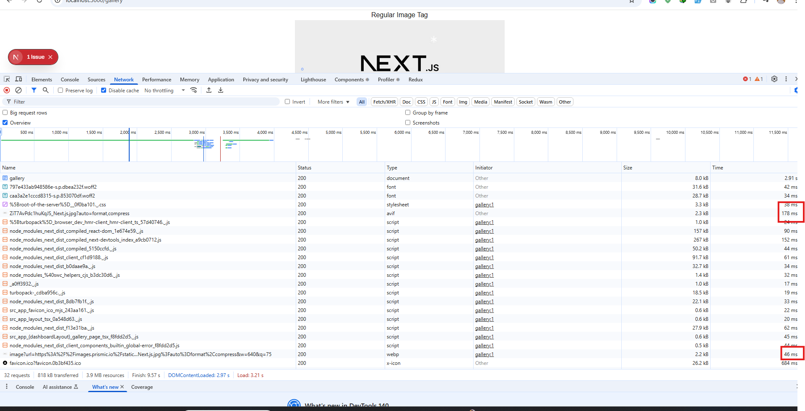
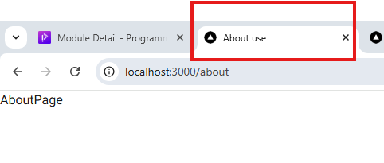
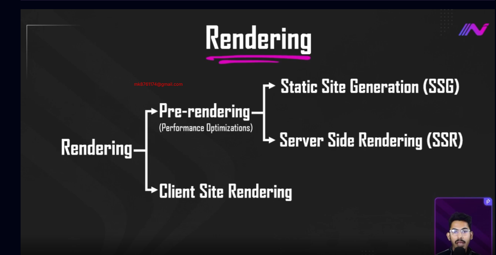
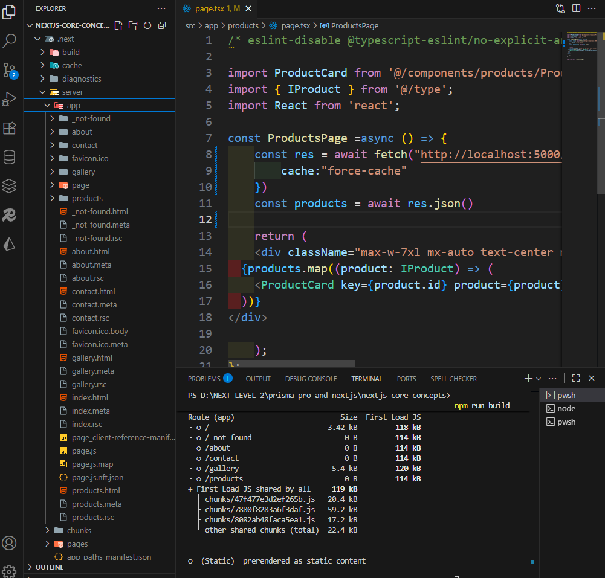
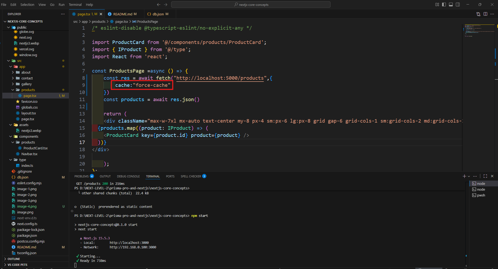
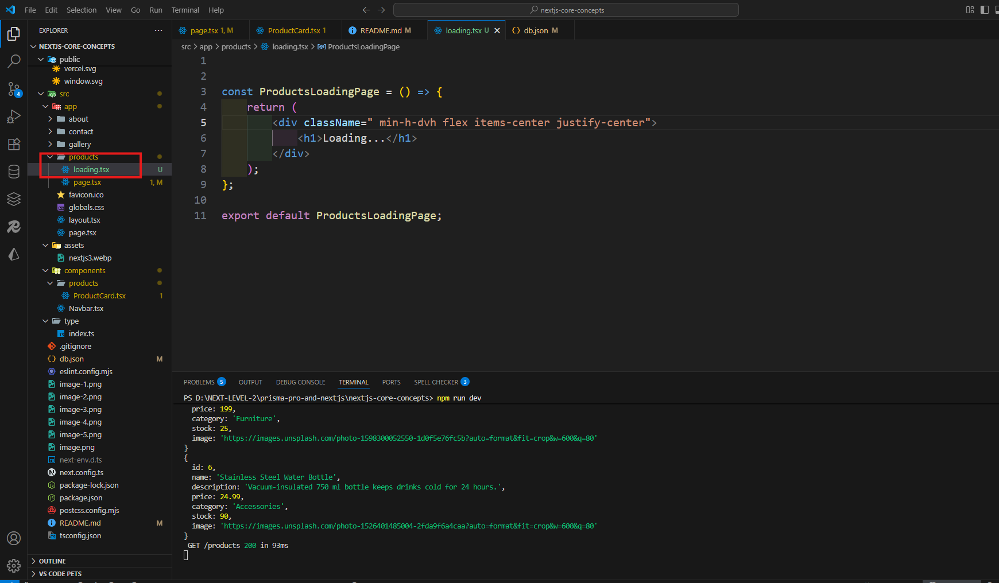

# Next.js Core Concepts
In this module, we’ll dive into the core concepts of Next.js to take your skills to the next level. You’ll learn how to optimize images, fonts, and metadata for better performance and SEO, explore pre-rendering strategies like SSG, SSR, and ISR, and practice advanced data fetching techniques. We’ll also cover global error handling, active links, and wrap up with hands-on tasks to solidify your learning.

# Next.js Core Concepts part-1
## 52-1 Optimize image using Image Component
### external image use case
- first image using local image tag 
- 2nd image using nextjs image must be ad width and height and add src link next.config 
- next.config.ts
```ts
import type { NextConfig } from "next";

const nextConfig: NextConfig = {

  // images: {
  //   remotePatterns: [new URL("https://images.prismic.io/staticmania/ZiT7AvPdc1huKqJS_Next.js.jpg?auto=format,compress")],
  // },
// if i am using 1 k image all image source adding is very boring  here is a update solution
  images: {
    remotePatterns: [
      {
        protocol: 'https',
        hostname: '**',
     
      },
    ],
  },
};

export default nextConfig;

```
- gallery folder
```ts
import Image from 'next/image';
import React from 'react';

const GalleryPage = () => {
    return (
        <div className='text-center'>
       <h1>Regular Image Tag</h1>
       
        <h1>Next js image Component</h1>
        <Image 
            src="https://images.prismic.io/staticmania/ZiT7AvPdc1huKqJS_Next.js.jpg?auto=format,compress"
            alt='next image'
            width={500} 
            height={500}
            className=' mx-auto'
            />
            
        </div>
    );
};

export default GalleryPage;
```
- this is output nextjs is more fast change type name and also so fast mili second

 ### internal image use case
 ```ts
 import Image from 'next/image';
import React from 'react';
import nextImg from '../../../assets/nextjs3.webp'

const GalleryPage = () => {
    return (
        <div className='text-center'>
       <h1>Regular Image Tag</h1>
       
        <h1>Next js image Component</h1>
        <Image 
            src="https://images.prismic.io/staticmania/ZiT7AvPdc1huKqJS_Next.js.jpg?auto=format,compress"
            alt='next image'
            width={500} 
            height={500}
            className=' mx-auto'
            />
        <h1> local Next js image from assets Folder Component</h1>
        <Image 
        // must import from assets folder
            src={nextImg}
            alt='next image'
            width={500} 
            height={500}
            className=' mx-auto'
            />
        <h1> local Next js image from public Folder Component</h1>
        <Image 
            // src="/public/nextjs3.webp" / must be cancel /public and not need to import
            src="/nextjs3.webp"
            alt='next image'
            width={500} 
            height={500}
            className=' mx-auto'
            />
            
        </div>
    );
};

export default GalleryPage;
```

## 52-2 Optimize Fonts, Improve SEO with Metadata, and Use Import Aliases
###  Optimize Fonts
```ts
import type { Metadata } from "next";
import { Geist, Geist_Mono,Roboto } from "next/font/google";
import "./globals.css";

const geistSans = Geist({
  variable: "--font-geist-sans",
  subsets: ["latin"],
});
const roboto = Roboto({
  weight: '400',
  subsets: ["latin"],
});

const geistMono = Geist_Mono({
  variable: "--font-geist-mono",
  subsets: ["latin"],
});

export const metadata: Metadata = {
  title: "Create Next App",
  description: "Generated by create next app",
};

export default function RootLayout({
  children,
}: Readonly<{
  children: React.ReactNode;
}>) {
  return (
    <html lang="en">
    
      <body
      // just add here
        className={roboto.className}
      >
        {children}
      </body>
    </html>
  );
}
```
### Improve SEO with Metadata

```ts
import { Metadata } from "next";


export const metadata:Metadata = {
    title:"About use",
    description:"this is about us page"
}

const AboutPage = () => {
    return (
        <div>
            AboutPage 
        </div>
    );
};

export default AboutPage;
```
### Use Import Aliases
- absolute path import
```ts
import Navbar from '@/components/Navbar';
```
- relative path import when we are fount dot notation
 just add @ first to folder
```ts
// import nextImg from '../../assets/nextjs3.webp'
import nextImg from '@/assets/nextjs3.webp'
```
## 52-3 Explain core concept of pre-rendering (SSG + SSR)

#### static site generation(ssg)
When we build a Next.js project and deploy it to a hosting service like Vercel, Render, or Firebase, we first create a build folder.
During the build process, Next.js generates static content as HTML and bundled files.
These files are then deployed to the hosting provider.
After deployment, when a user visits a route such as /contact, the browser sends a request to the host, which returns the pre-built HTML for that route.
The browser displays the content immediately.
This whole process is called Static Site Generation (SSG).
- not dynamic data here
#### server side rendering

When a user requests a page that needs dynamic data, the browser sends a request to the server.
The server queries the database, retrieves the requested data, and uses it to generate the complete HTML for that page.
The server then sends this HTML back to the browser, which displays it to the user.

## 52-4 Set-up Json Server for Next Level Data Fetching
- fetch method use condition 
- 1 server side and we are know nextjs is by default server side rendering
- 2 use async await  method

- use dami json date from json-server https://www.npmjs.com/package/json-server


```ts
/* eslint-disable @typescript-eslint/no-explicit-any */

import ProductCard from '@/components/products/ProductCard';
import { IProduct } from '@/type';
import React from 'react';

const ProductsPage =async () => {
    const res = await fetch("http://localhost:5000/products")
    // db.json
    const products = await res.json()
    console.log(products)
    return (
    <div className="max-w-7xl mx-auto text-center my-8 px-4 sm:px-6 lg:px-8 grid gap-6 grid-cols-1 sm:grid-cols-2 md:grid-cols-3">
  {products.map((product: IProduct) => (
    <ProductCard key={product.id} product={product} />
  ))}
</div>

    );
};

export default ProductsPage;
```
- productCard.tsx
```ts
import { IProduct } from "@/type";


const ProductCard = ({product}:{product:IProduct}) => {
    console.log(product)
    return (
    <div className="max-w-sm  bg-red-500  rounded-lg shadow-md overflow-hidden  ">
      {/* Product Image */}
      

      {/* Product Info */}
      <div className="mt-4">
        <h3 className="text-lg font-semibold text-gray-900 ">{product.name}</h3>
        <p className="text-sm text-gray-600 mt-1 line-clamp-2">{product.description}</p>

        <div className="mt-2 text-gray-700">
          <p>Category: {product.category}</p>
          <p>Price: ${product.price.toFixed(2)}</p>
          <p>Stock: {product.stock}</p>
          <p>Rating: {product.rating}</p>
        </div>
      </div>
    </div>
  );
};

export default ProductCard;
```
-- type/index.ts
```ts

export interface IProduct {
  id: number;
  name: string;
  description: string;
  price: number;
  category: string;
  stock: number;
  image: string;
  rating: number;
}
```

## 52-5 Explain SSG by Next-level Data Fetching



- cache: "force-cache" tells Next.js (and underlying React Server Components) to store the response in CDN/cache.
- The first time the page is built or visited, Next.js fetches the data from your API (localhost:5000/products).
- The fetched data is then cached in CDN.
- Next time a user visits the page, Next.js serves the cached HTML/data immediately without fetching from the server again.
```ts
/* eslint-disable @typescript-eslint/no-explicit-any */

import ProductCard from '@/components/products/ProductCard';
import { IProduct } from '@/type';
import React from 'react';

const ProductsPage =async () => {
    const res = await fetch("http://localhost:5000/products",{
        cache:"force-cache"
    })
    const products = await res.json()
    
    return (
    <div className="max-w-7xl mx-auto text-center my-8 px-4 sm:px-6 lg:px-8 grid gap-6 grid-cols-1 sm:grid-cols-2 md:grid-cols-3">
  {products.map((product: IProduct) => (
    <ProductCard key={product.id} product={product} />
  ))}
</div>

    );
};

export default ProductsPage;
```
## 52-6 Breaking the Limits of Static Sites with Next.js ISR
- here is a small problem when we are deployed if i want any change not updated instant 
again rebuild and redeploy then worked so its very painful

```ts
const ProductsPage =async () => {
    const res = await fetch("http://localhost:5000/products",{
        cache:"force-cache"
    })
    const products = await res.json()
 ```
-  solution isr policy
-  This means the cached page is considered fresh for 5 seconds.
After those 5 seconds, when the next user visits the page, Next.js will fetch fresh data in the background and rebuild the HTML.
       
- The browser does not auto-reload every 5 seconds.

Only the part of the page that uses fetch with revalidate will get updated.

The first visitor after the 5-second window might briefly see the old data, but the next visitor will get the updated content.
```ts
/* eslint-disable @typescript-eslint/no-explicit-any */

import ProductCard from '@/components/products/ProductCard';
import { IProduct } from '@/type';
import React from 'react';

const ProductsPage =async () => {
    const res = await fetch("http://localhost:5000/products",{
     next:{
      // after every 5 seconds he reload the website and update content
      // automatically re rendering
     ❌ revalidate:5
      // better approach use tags because if use  revalidate:5 every 5 second he called automatically if also not needed and db pressured
    //✅ tags:["products"]
     }
    })
    const products = await res.json()
    
    return (
    <div className="max-w-7xl mx-auto text-center my-8 px-4 sm:px-6 lg:px-8 grid gap-6 grid-cols-1 sm:grid-cols-2 md:grid-cols-3">
  {products.map((product: IProduct) => (
    <ProductCard key={product.id} product={product} />
  ))}
</div>

    );
};

export default ProductsPage;
```
## 52-7 Advance Data Fetching Strategies with SSR
- Client request → Next.js server

When a user visits /products, the request goes to your Next.js server.

- fetch(..., { cache: 'no-store' })

This tells Next.js never to cache the response.

Every request forces a brand-new fetch from your database/API.

- Server renders HTML on each request

The server waits for the database data.

Next.js builds the HTML with that fresh data and sends it to the browser.

- No build-time generation

Nothing is pre-rendered during next build.

HTML is created only at request time, so users always see the latest data.
```ts
/* eslint-disable @typescript-eslint/no-explicit-any */

import ProductCard from '@/components/products/ProductCard';
import { IProduct } from '@/type';
import React from 'react';

const ProductsPage =async () => {
    const res = await fetch("http://localhost:5000/products",{
  cache:"no-store"
    })
    const products = await res.json()
    
    return (
    <div className="max-w-7xl mx-auto text-center my-8 px-4 sm:px-6 lg:px-8 grid gap-6 grid-cols-1 sm:grid-cols-2 md:grid-cols-3">
  {products.map((product: IProduct) => (
    <ProductCard key={product.id} product={product} />
  ))}
</div>

    );
};

export default ProductsPage;
```
- handle loading....


## 52-8 Handle global errors with built-in error page
- error.tsx ,not-found as like name convention must be use documentation in next.js
- props use error,reset
- error automatically entire folder
- reset = if network unstable or server request timeout then  fetch re rendering or re call page reload again

```ts
"use client"

import { useEffect } from "react";

const ErrorPage = ({error,reset}: {
  error: Error & { digest?: string }
  reset: () => void
}) => {
     useEffect (() => {
    // Log the error to an error reporting service
    console.error(error)
  }, [error])
    return (
        <div>
            <h1 className="text-4xl  text-center mx-auto text-red-500">Something went Wrong</h1>
            <h1 className="text-4xl  text-center mx-auto  text-red-500">{error?.message}</h1>
      <div className="text-center">
              <button onClick={()=> reset()} className= "text-4xl p-4  text-center mx-auto  text-red-500 bg-yellow-500">try again</button>
      </div>
        </div>
    );
};

export default ErrorPage;
```
## 52-9 Handling Active Links in Next.js
- active links handle with pathname hook 
```ts
"use client"
import Link from 'next/link';
import { usePathname } from 'next/navigation';
import React from 'react';

const Navbar = () => {
    const pathname= usePathname();
    console.log(pathname)
   return (
       <div className='w-full flex items-center justify-between px-6 py-3'>
           <div><Link href="/">Next js</Link></div>
           <div className='flex  space-x-4'>
               <Link href='/about'>About</Link>
               <Link href='/contact'>Contact</Link>
               <Link href='/gallery' className={`${
                pathname === "/gallery" ? "text-blue-400 font-semibold underline":"hover:underline"
                }`}>Gallery</Link>
               <Link href='/products' className={`${
                pathname === "/products"? "text-blue-400 font-semibold underline":"hover:underline"
               }`}>Products</Link>
           </div>
       </div>
   );
};

export default Navbar;
```
## 52-10 Module Summary and practice task
```ts
import PostCard from '@/components/posts/PostCard';
import { IPost } from '@/type';
import React from 'react';

const PostPage =async () => {
    const res = await fetch("https://jsonplaceholder.typicode.com/posts?_limit=9",{
      // 1  in build time create html content but not update content not retrive again build and then you can see update content
        cache:"force-cache"
        // 2 after every 30 second he render full project
        next:{
          revalidate:30
        }
        // 3 he not create again when user request then he created but loading page add because data come to server thats wy some loading needed
          cache:"no-store"
    });
    const posts = await res.json()
    return (
        <div>
            <h1 className='text-center text-4xl'>All posts</h1>
            {
                posts?.map((post:IPost) =>(<PostCard key={post.id} post={post}/> ))
            }
        </div>
    );
};

export default PostPage;
```